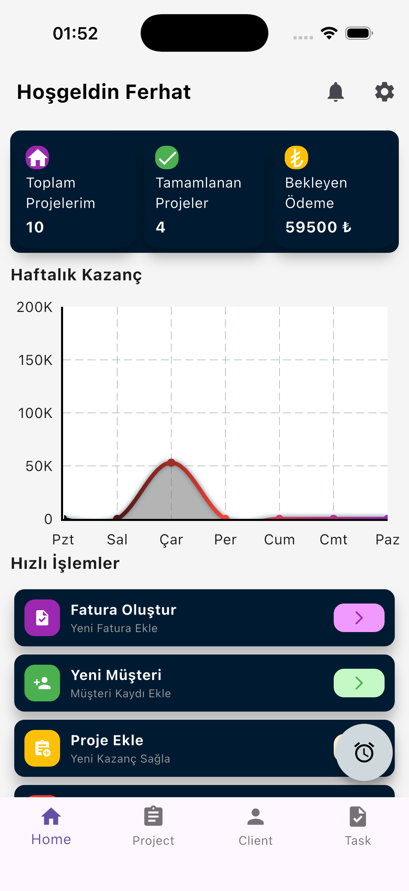
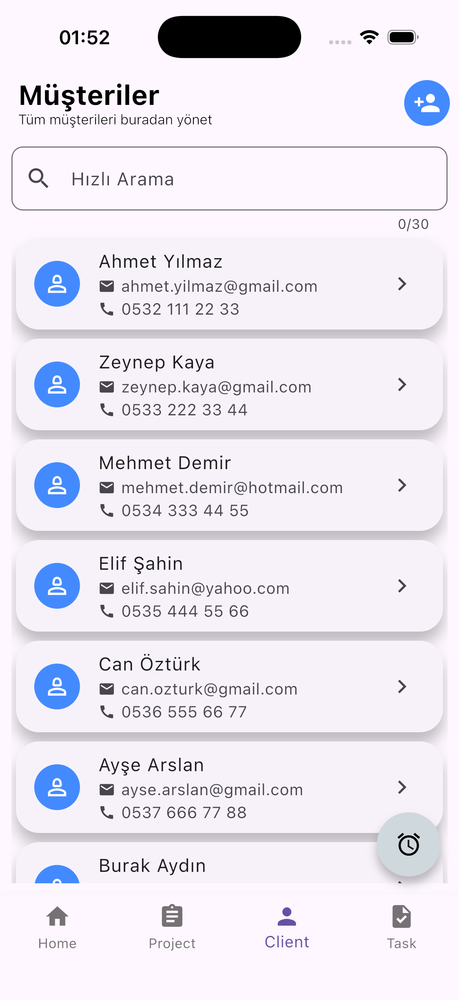
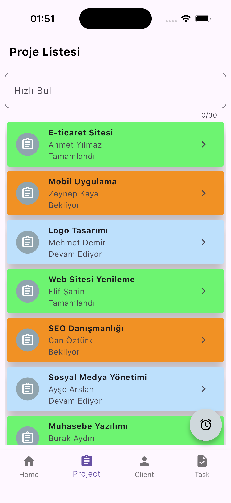
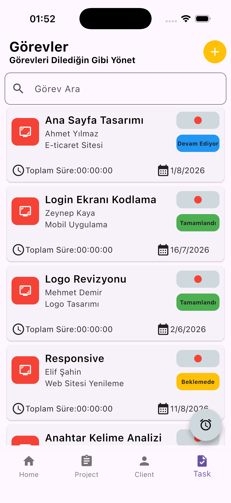
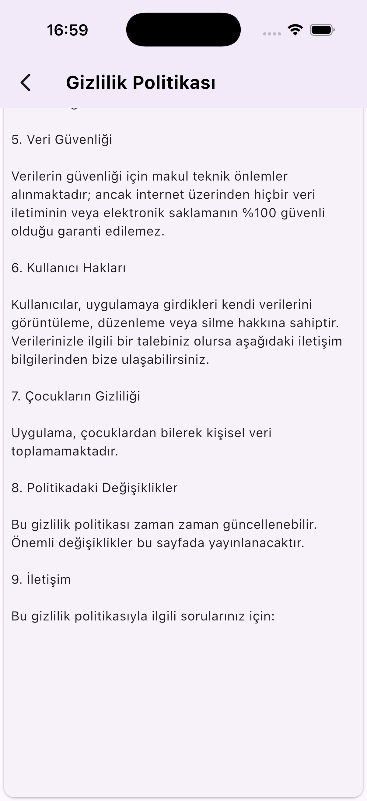

  
# Freelancer Takip Sistemi
### Flutter Projelerinizi Dilediğiniz Gibi Yönetin
 

| Dashboard | Customer | Project | Task | StopWatch |
|-------|------|--------|---------|---------|
|  |  |  |  |  |

## Proje Hakkında

Freelancer Takip Sistemi, bağımsız çalışan birinin (freelancer) müşterilerini, bu müşterilere ait projelerini, projelere bağlı görevlerini, bu görevlere harcadığı zamanı ve kazancını tek bir yerden takip edebilmesini sağlayan bir mobil uygulama. Listeleme, ekleme/düzenleme/silme, durum takibi, basit bir zamanlayıcı ve özet bir dashboard içeren, küçük ama gerçek bir uygulamanın sahip olması gereken hemen her şeyi barındırıyor.

**Neden bu proje?**
- Gerçek hayatta karşılığı olan, anlamlı bir problemi çözüyor — sadece "örnek uygulama" değil.
- Birbiriyle ilişkili veri modelleri (müşteri → proje → görev) içeriyor, bu da state management ve mimari kararları anlamlı hale getiriyor.
- Zaman takibi özelliği, asenkron/timer mantığını gerçek bir senaryoda uygulamayı sağlıyor.
- İstersen ileride gerçek bir backend'e bağlanarak network katmanı da eklenebilecek bir yapıya sahip.

## Temel Özellikler

### Müşteri (Client) Yönetimi
- Müşteri ekleme, düzenleme, silme
- Müşteri listesi (isim, şirket, iletişim bilgisi)
- Bir müşteriye ait projelerin listelendiği detay ekranı

### Proje (Project) Yönetimi
- Bir müşteriye bağlı proje oluşturma
- Proje durumu: Devam Ediyor / Tamamlandı / Beklemede
- Proje ücreti (sabit ücret ya da saatlik ücret)

### Görev (Task) Yönetimi
- Bir projeye bağlı görev oluşturma
- Görev tamamlandı/tamamlanmadı durumu
- Görev önceliği (Düşük / Orta / Yüksek) — opsiyonel

### Zaman Takibi
- Bir görev için başlat/durdur (start/stop) şeklinde bir zamanlayıcı
- Kaydedilen zaman kayıtlarının (time entry) listesi
- Bir proje için toplam harcanan sürenin hesaplanması

### Kazanç / Ödeme Takibi
- Proje bazlı kazanç hesaplama (saatlik ücret × harcanan süre, ya da sabit ücret)
- Ödendi / Ödenmedi durumu

### Dashboard (Özet Ekranı)
- Aktif proje sayısı
- Bu ay tamamlanan görev sayısı
- Toplam / bekleyen kazanç
- (Opsiyonel) Basit bir grafikle haftalık çalışma süresi

## Ekran Listesi

| Ekran | İçerik |
|---|---|
| Dashboard | Özet istatistikler, hızlı erişim kartları |
| Müşteri Listesi | Tüm müşterilerin listesi, arama/filtreleme, yeni müşteri ekleme butonu |
| Müşteri Detayı | Müşteri bilgileri + o müşteriye ait projelerin listesi |
| Proje Listesi | Tüm projeler, duruma göre filtreleme (Devam Ediyor / Tamamlandı / Beklemede) |
| Proje Detayı | Proje bilgileri, görev listesi, toplam harcanan süre, kazanç bilgisi |
| Görev Detayı | Görev bilgisi, zamanlayıcı (start/stop), o göreve ait zaman kayıtları |
| Ekle / Düzenle Formları | Müşteri, proje ve görev için ekleme/düzenleme formları |
| Ayarlar (opsiyonel) | Para birimi, varsayılan saatlik ücret gibi basit ayarlar |

## Veri Modeli

Aşağıdaki 4 temel varlık (entity) projenin çekirdeğini oluşturuyor. İlk aşamada bunları basit Dart sınıfları olarak modellemek yeterli; ileride local veritabanına (sqflite/Hive) taşınabilir.

**Client (Müşteri)**
- Benzersiz kimlik
- Müşteri/şirket adı
- İletişim e-postası
- İletişim telefonu

**Project (Proje)**
- Benzersiz kimlik
- Bağlı olduğu müşteri
- Proje adı
- Durum: ongoing / completed / onHold
- Ücret tipi: fixed / hourly
- rateAmount

**Task (Görev)**
- Benzersiz kimlik
- Bağlı olduğu proje
- Görev adı
- Tamamlandı mı
- Öncelik: low / medium / high (opsiyonel)

**TimeEntry (Zaman Kaydı)**
- Benzersiz kimlik
- Bağlı olduğu görev
- Başlangıç zamanı
- Bitiş zamanı (devam ediyorsa null)

## Teknik Gereksinimler

- **State Management:** Provider (ileride istenirse Riverpod'a geçilebilir)
- **Navigasyon:** Flutter'ın kendi Navigator'ı yeterli, ekstra bir routing paketine gerek yok
- **Veri Saklama:** Başlangıçta hafızada (in-memory) bir liste yeterli; sonraki aşamada sqflite ya da Hive ile kalıcı hale getirilecek
- **UI:** Material Design bileşenleri; farklı ekran boyutlarında (telefon/tablet) düzgün görünmesine dikkat edilmeli
- **Mimari:** Kod, baştan itibaren data / domain / presentation gibi basit katmanlara ayrılarak ilerlenmeli — sonradan ayırmak, baştan ayırmaktan çok daha zor
- **Kod Organizasyonu:** UI, state ve veri erişim kodları birbirine karıştırılmamalı
- **Git Kullanımı:** Anlamlı, küçük commit'ler halinde ilerlenmeli (tek commit'te bitirilmiş bir proje istenmiyor)

